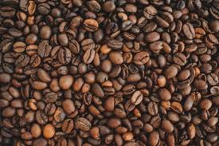
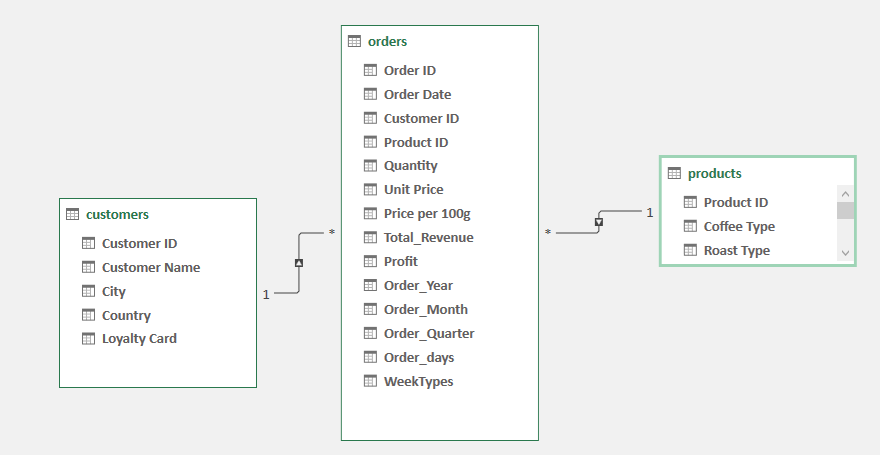

# BestBeansCrafters Coffee Sales Analysis


## Project Overview 

This data analysis project aims to provide insights into the sales performance of an imaginary
coffee bean company over the last four years. I seeks to identify trends, gain deeper understanding
of the company's performance and make data-driven recommendations. This project is to display my Excel 
and data modelling skills acquired in the course of my learning with CISCO and Data_with_Decision.

## Disclaimer

This project is an imaginary project, it doesn't represent any real-world company. Kindly exercise caution.

## Problem Statement

It is September of 2022, an artisanal roastry, "BestBeanCrafters," endeavors to perfect the art and science
of coffee brewing by assessing its performance over the last four(4) years.It wishes to build a multi-dollar plant
at the city that contributed the highest profit over the last four years.The company wishes to acknowledge the customer
with the highest sales at its We-Care party. Before the year ends, the general manager wishes to present to the 
company's stakeholders, the years with profit, transactions and revenue above average. He wishes to present the profit
contribution of the top three months,and others. He is also interested in knowing the highest selling coffee type,
profitable coffee roast type and product size. As such, "Seth Baidoo", the company's analyst have 
been tasked to carry out an in-depht analysis for data-driven decision to been made.
	
To execute this task, the following question were outlined:
1. Which city has the highest profit made?
2. Are there specific years that consistently exhit higher profit,transactions and revenue above average?
3. How does the quantity of products sold vary across different quarters of the year?
4. Which months have made the highest profit?
5. Which of our customers is the most important?
6. Are loyal customers making more significat purchases, and does their loyalty contribute to higher profit?
7. Which coffee roast type is most profitable?
8. Which product size is most profitable?
9. Which coffee type is the most selling product?

## Tools
Excel was used for cleaning, anlysis and visualization

## Data Sources
The dataset was sourced from Kaggle. Dataset can be found [here](https://www.kaggle.com/datasets/saadharoon27/coffee-bean-sales-raw-dataset/data)
. It contain 3 different sheets/tables(Customers, Orders and Products).
1. Customers has 1000 rows and 7 columns.
2. Orders has 1000 rows and 6 columns.
3. Products has 48 rows and 7 columns.

## Data Cleaning/Transformation

Data was cleaned and transformed using Power Query Editorof Excel. 
Below are some of the steps that were used:
- Loading tables: the tables were loaded into a model using "only create connection" and
  "add this data to the data model" options on the import pop-up menu.
- Dropping of unwanted columns: Using the choose column, unwanted columns were dropped
  from the Customers and Orders tables.
- Merging tables: To calculate the total revenue, an inner join was performed to join the
  Orders table which has(quantity column) and Products table which has (price column) using
  "merge queries"
-Calculating Revenue: A custom column was inserted and the total revenue was calculated.
-Date extraction: To do an in-depht time series analysis, the date extraction option under "Add Column"
 menu was used to extract the years, months names, day names and quarter of year.
- Shortening of Name: to achieve simplicity, the months and days of the week name were shortened to the
  first three characters using the extract function under the transform menu.
- Categorization of days: Using a conditional column, the days of the week were categorized into
"Weekday or Weekend"
- Replacement of Names: to enabled easy understaning of the data,the first three(3) characters of the Coffee
 type and Roast typ with their full names.

## Data Modelling

To enable efficient retrieval of the data during analysis the tables were connected. A star schema model was created 
using Power Pivot. In the model, the "Orders" table is the fact table. The "Customers" and "Products" tables
are the dimentional tables. They are connected to the "Orders" table via common columns: "ProductID" and 
"CustomerID". A (1:*) relationship is created among the tables.

## Analysis & Visualization

Some advance calculations were performed using Data Analysis Expression in Power Pivot. 
To calculate the Profit Margin percentage and Number of transactions the following DAX was written.
``` DAX
=DIVIDE([Sum of Profit],[Sum of Total_Revenue],0)
=COUNTROWS(orders)
```
## Findings
- The Company's sales have been steadily increasing over the past years, with a noticeable peak in 2021.
- Arabica is the most preferred Coffee type by Customers but Liberica is the most profitable Coffee type with a 36%  of
total Profit market share
- Customers without loyalty cards contributed more than half (53%) of the overall profit compare to those with loyalty cards.
- 2021 was the peak year compared to the other years in terms of profit,revenue and transaction.
- Our most important customer varies, however, Terri Farra is our most important customer across the 4 years with 22 purchases.
- 0.2kg Coffee Products consisted the most profitable products in terms of size, contributing 54% of the total profit market share.
  
## Recommendation
- Production must be limited during off-peak (last quarter of every year) periods to save cost
- The production quantity of Arabica coffee should be increased
- Much resources should be allocated to high-profit months: March, June and October.
-Marketing efforts should be tailored to attract  and retain non-loyal customers. 
- Targeted marketing campaigns should be  implemented in cities such as Washington and New York City to maximize profit

### Limitations
- The 2022 records ends in Augusts,as such years comparison is limited.

## References

 
