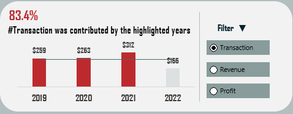

# BestBeansCrafters Coffee Sales Analysis


## Project Overview 

This data analysis project aims to provide insights into the sales performance of an imaginary
coffee bean company over the last four years. I seek to identify trends, gain a deeper understanding
of the company's performance and make data-driven recommendations. This project is to display my Excel 
and data modelling skills acquired during my learning with CISCO and Data_with_Decision.

## Disclaimer

This project is an imaginary project, it doesn't represent any real-world company. Please be sure to exercise caution.

## Problem Statement

It is September of 2022, and an artisanal roastery, "BestBeanCrafters," endeavours to perfect the art and science
of coffee brewing by assessing its performance over the last four(4) years. It wishes to build a multi-dollar plant
in the city that contributed the highest profit over the last four years. The company wishes to acknowledge the customer
with the highest sales at its We-Care party. Before the year ends, the general manager wishes to present to the 
company's stakeholders, the years with profit, transactions and revenue above average. He wishes to present the profit
contribution of the top three months and others. He is also interested in the highest-selling coffee type,
profitable coffee roast type and product size. As such, "Seth Baidoo", the company's analyst have 
been tasked to carry out an in-depth analysis for data-driven decisions to be made.
	
To execute this task, the following questions were outlined:
1. Which city has the highest profit made?
2. Are there specific years that consistently exhibit higher profit, transactions and revenue above average?
3. How does the quantity of products sold vary across different quarters of the year?
4. Which months have made the highest profit?
5. Which of our customers is the most important?
6. Are loyal customers making more significant purchases, and does their loyalty contribute to higher profit?
7. Which coffee roast type is most profitable?
8. Which product size is most profitable?
9. Which coffee type is the most selling product?

## Tools
Excel was used for cleaning, analysis and visualization

## Data Sources
The dataset was sourced from Kaggle. The dataset can be found [here](https://www.kaggle.com/datasets/saadharoon27/coffee-bean-sales-raw-dataset/data)
. It contains 3 different sheets/tables(Customer, Order and Product).
1. Customer table has 1000 rows and 7 columns.
2. The order table has 1000 rows and 6 columns.
3. The product table has 48 rows and 7 columns.

## Data Cleaning/Transformation

Data was cleaned and transformed using Power Query Editor of Excel. 
Below are some of the steps that were used:
- Loading tables: the tables were loaded into a model using the "only create connection" and
  "add this data to the data model" options on the import pop-up menu.
- Dropping of unwanted columns: Using the "choose column", unwanted columns were dropped
  from the Customers and Orders tables.
- Merging tables: To calculate the total revenue, an inner join was performed to join the
  Orders table which has(a quantity column) and the Products table which has (a price column) using
  "merge queries"
-Calculating Revenue: A custom column was inserted and the total revenue was calculated.
-Date extraction: To do an in-depth time series analysis, the date extraction option under "Add Column"
 menu was used to extract the years, months names, day names and quarters of the year.
- Shortening of Name: to achieve simplicity, the months and days of the week names were shortened to the
  first three characters using the extract function under the transform menu.
- Categorization of days: Using a conditional column, the days of the week were categorized into
"Weekday or Weekend"
- Replacement of Names: to enable easy understanding of the data, the first three(3) characters of the Coffee
 type and Roast type with their full names.

## Data Modelling

To enable efficient retrieval of the data during analysis the key tables needed were connected. The tables were:

| Table Name|Brief Description |
|---------------|----------------- |
|Order          |This contains transactional records such as customer name, orderId, price etc.|
| Customer      |The table holds customer records such as ID, name, Loyalty status etc.|
|Product        | It houses productID, name, RoastType, CoffeeType etc.|
	       


A star schema model was created 
using Power Pivot. In the model, the "Order" table is the fact table. The "Customer" and "Product" tables
are the dimensional tables. They are connected to the "Order" table via common columns: "ProductID" and 
"CustomerID". A (*:1) relationship is created among the tables.

## Analysis & Visualization

 Advanced calculations were performed using Data Analysis Expression in Power Pivot to aid the analysis. The DAX code written is shown below: 
``` DAX
=DIVIDE([Sum of Profit],[Sum of Total_Revenue],0)
=COUNTROWS(orders)
```
It calculates the Profit Margin percentage and Number of transactions.

The analysis was made under two different themes(Time series and others:Products,location and Customer) while visualization is across three tabs.
The time series and others visualizations are displayed below:


1. It is observed that t 2019,2020 and 2021 were consistently high above average in terms of profit, transaction and revenue. Profit-wise, these 3 contribute 83% of the market share. However, 2021 is the most profitable year. As shown below:

   | Profit By Year|Transaction By Year| Revenue By Year|
   ----------------|-------------------|----------------|
   |   |      |  |

2. March, June and October is the most profitable months with a 29% profit share. Visualiztion is shown below:
   

3. The light roast coffee brought in 37% of the total profit.

    

5. Arabica coffee was the most sold coffee type with a total of 947.

   
7. More than half of the total profit were from non-loyal customers
8. Washington is the city accruded most profit. It brought in $34.

         
## Findings
- The Company's sales have been steadily increasing over the past years, with a noticeable peak in 2021.
- Arabica is the most preferred Coffee type by Customers but Liberica is the most profitable Coffee type with 36%  of
Total profit market share
- Customers without loyalty cards contributed more than half (53%) of the overall profit compared to those with loyalty cards.
- 2021 was the peak year compared to the other years in terms of profit, revenue and transaction.
- Our most important customer varies, however, Terri Farra is our most important customer across the 4 years with 22 purchases.
- 0.2kg Coffee Products consisted of the most profitable products in terms of size, contributing 54% of the total profit market share.
  
## Recommendation
- Production must be limited during off-peak (last quarter of every year) periods to save cost
- The production quantity of Arabica coffee should be increased
- Many resources should be allocated to high-profit months: March, June and October.
-Marketing efforts should be tailored to attract  and retain non-loyal customers. 
- Targeted marketing campaigns should be  implemented in cities such as Washington and New York City to maximize profit

### Data & Report Limitations
- The extracted data does not include all 2022 records. 2022 records end in August.
- The data had no nulls but it does not provide why certain months are missing from the data.
- From the data it is impossible to identify the company it belongs to or whether is fabricated data

## References
[CISCO](skillsforAll.com)

[Data with Decision](https://www.youtube.com/c/datawithdecision)
 
